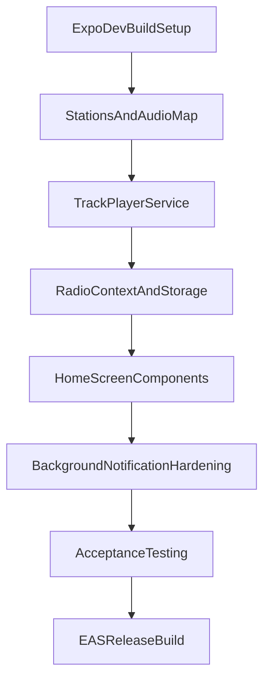

# План реализации MVP «ЭФИР 1941–1945» на Expo CLI

## Технический подход
- Базовая платформа: Expo CLI + **Development Build** (`expo prebuild`) для подключения нативного Android-сервиса аудио.
- Аудиодвижок: `react-native-track-player` (через config plugin + нативная сборка), а не `expo-av`, чтобы выполнить требования по foreground service и media notification actions.
- Режим данных: полностью офлайн, аудио и метаданные пакуются в приложение.
- Целевая архитектура сохраняется из ТЗ (`src/components`, `src/context`, `src/services`, `src/utils`), но адаптируется к Expo-структуре и pipeline сборки.

## Этап 1. Подготовка Expo-проекта и зависимостей
- Проверить текущий Expo-проект и версии SDK/Gradle/AGP на совместимость с `react-native-track-player`.
- Установить зависимости:
  - `react-native-track-player`
  - `@react-native-community/slider`
  - `@react-native-async-storage/async-storage`
- Подключить `expo-dev-client` и выполнить `expo prebuild` для генерации/обновления `android/`.
- Настроить плагины и Android-конфиг через `app.json`/`app.config.ts`:
  - foreground service permissions
  - notification channel
  - media style notification behavior
- Зафиксировать ограничения: запуск и тесты через Development Build (`expo run:android`), не через Expo Go.

## Этап 2. Модель данных и упаковка офлайн-контента
- Создать/уточнить [src/assets/stations.json](src/assets/stations.json) с полями `stations`, `years`, `emptyFrequencies`.
- Организовать аудио-ресурсы:
  - для Expo-совместимости хранить контент в `assets/audio/**`
  - сформировать явный маппинг `fileId -> require(...)` в отдельном модуле (например, `src/assets/audioMap.ts`), т.к. динамический `require` в RN ограничен.
- Добавить проверку целостности маппинга (валидатор на старте в dev): все `file` из `stations.json` существуют в `audioMap`.
- Учесть размер APK/AAB: подготовить рекомендации по сжатию и структуре ассетов без потери офлайн-режима.

## Этап 3. Аудиосервис и логика эфира
- Реализовать [src/services/player.ts](src/services/player.ts):
  - `setupPlayer()` и `updateOptions()` для фонового режима Android
  - `playStation(stationId, year)` с полной очередью треков станции/года
  - `playNoise()` для `static.mp3` в loop
  - `switchFrequency(newFreq, year)` со сценарием: `stop/reset -> noise 700ms -> новая очередь`
- Добавить playback service/handler для remote событий (`remote-play`, `remote-pause`, `remote-stop`) и обновления metadata уведомления (город/частота или `Пусто`).
- Обеспечить цикличность:
  - для станции — повтор очереди
  - для пустой частоты — repeat одного шумового трека.

## Этап 4. Состояние приложения и персистентность
- Реализовать [src/utils/storage.ts](src/utils/storage.ts) для `AsyncStorage` (`frequency`, `year`).
- Реализовать [src/context/RadioContext.tsx](src/context/RadioContext.tsx):
  - состояние `frequency`, `year`, `isPlaying`, `station`
  - восстановление состояния на холодном старте
  - автозапуск воспроизведения по восстановленным параметрам
  - немедленное сохранение при изменениях и запуск `switchFrequency`.
- Устранить гонки при быстрых переключениях (debounce/cancel token/serial queue внутри `switchFrequency`).

## Этап 5. UI главного экрана
- Реализовать [src/components/FrequencySlider.tsx](src/components/FrequencySlider.tsx):
  - дискретный выбор по индексу отсортированного массива частот (станции + пустые)
  - отображение значения в `кГц`.
- Реализовать [src/components/YearSelector.tsx](src/components/YearSelector.tsx):
  - выбор 1941–1945 (горизонтально/сегментированно)
- Реализовать [src/components/StationInfo.tsx](src/components/StationInfo.tsx):
  - частота, город или `Пусто`, выбранный год.
- Собрать [src/screens/HomeScreen.tsx](src/screens/HomeScreen.tsx) и связать с [App.tsx](App.tsx).

## Этап 6. Android background/notification hardening
- Проверить `AndroidManifest.xml` после prebuild:
  - foreground service declarations
  - media session/notification dependencies
- Настроить Notification Channel (Android 8+) и корректный pending intent на открытие главного экрана.
- Проверить сценарии жизненного цикла: сворачивание, блокировка экрана, убийство Activity, повторный вход.

## Этап 7. Тестирование и приёмка MVP
- Подготовить чек-лист по критериям приёмки из ТЗ:
  - восстановление `frequency/year`
  - шум на пустых частотах
  - шум-переход при switch
  - loop станции без пауз
  - фон + рабочее уведомление (Play/Pause/Stop)
- Прогон на Android 8/10/13 (или максимально близких девайсах/эмуляторах).
- Зафиксировать баги/ограничения и устранить блокирующие дефекты.

## Этап 8. Релизная сборка и передача
- Настроить EAS Build (Android release): `eas.json`, подпись, профиль сборки.
- Выпустить `apk` (для теста) и `aab` (для публикации).
- Подготовить короткий `README` для заказчика: запуск, структура контента, как обновлять `stations.json` и ассеты.

## Ключевые риски и решения
- `react-native-track-player` в Expo требует Development Build: это осознанный компромисс ради полного соответствия ТЗ по background media controls.
- Большой размер аудио: ранняя оптимизация кодеков/битрейта и строгая структура ассетов.
- Динамическая загрузка `require`: решается статическим `audioMap.ts` + валидатором соответствия `stations.json`.

## Целевая последовательность внедрения
